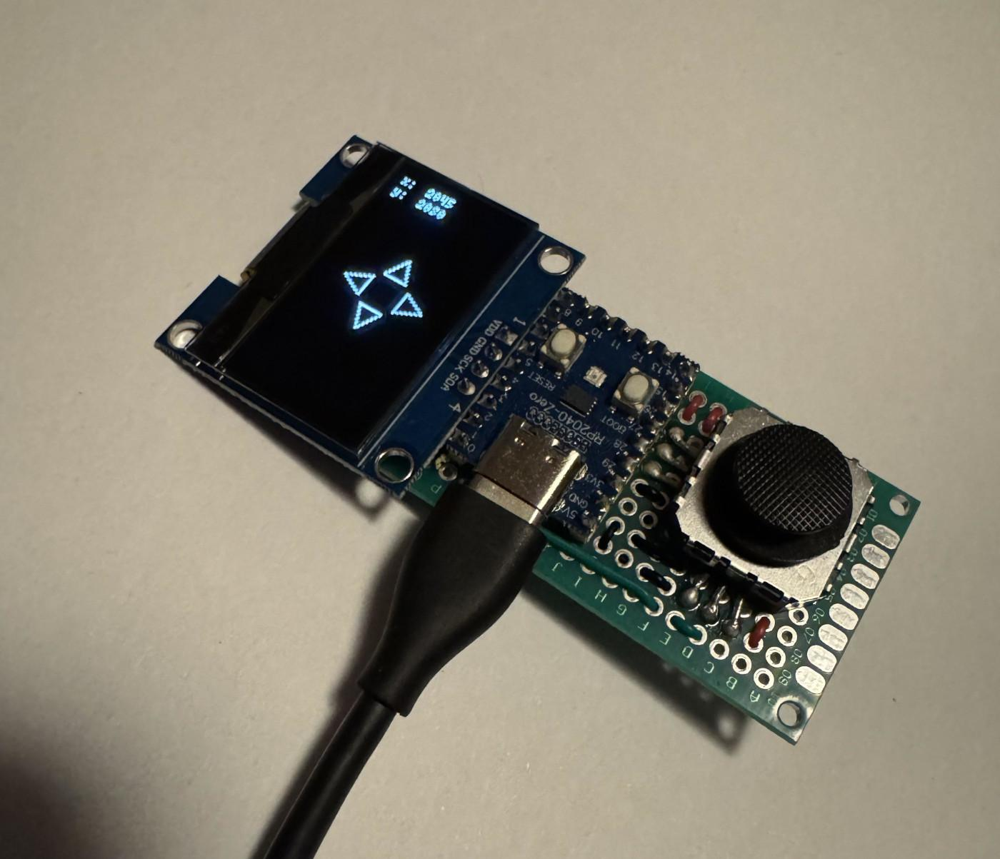
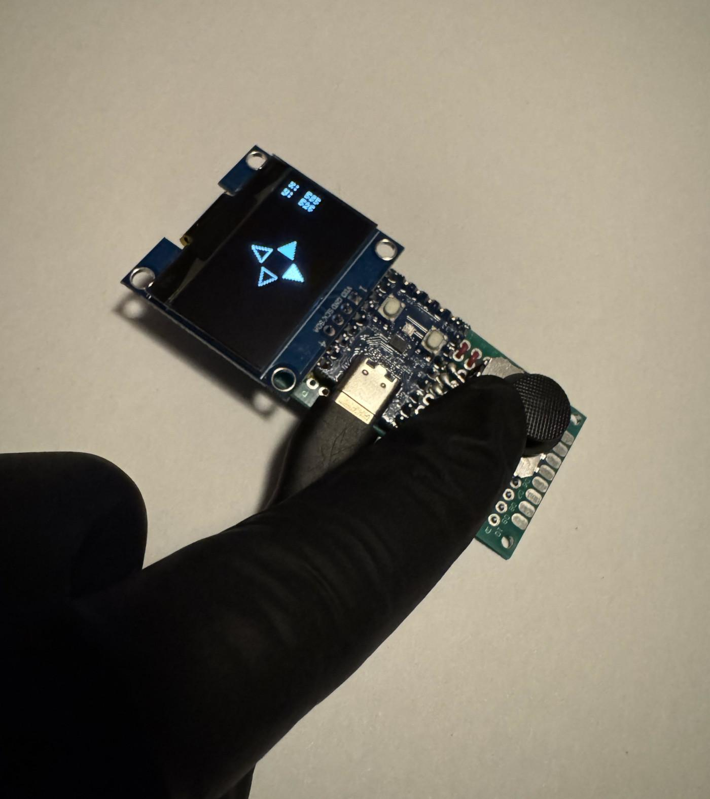
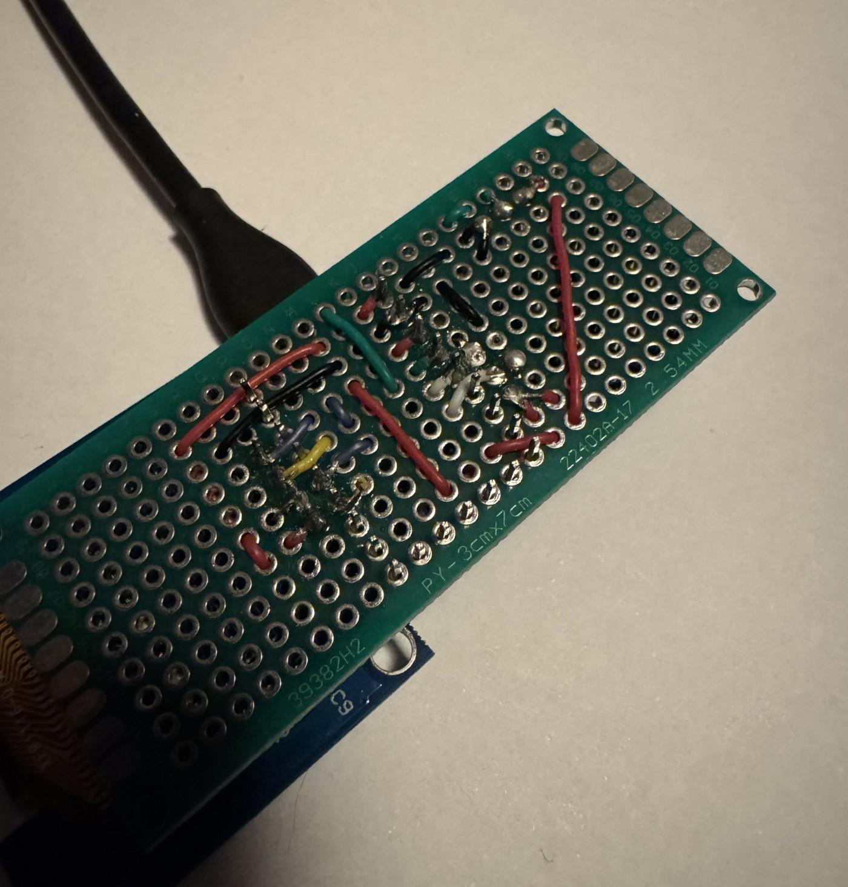

# rp2040-psp-joystick

```
rustup target add thumbv6m-none-eabi
cargo build --release
elf2uf2-rs -d target/thumbv6m-none-eabi/release/rp2040-psp-joystick
```

## Bill of materials

- rp2040-zero
- sh1106
- Dual Axis Mini XY Thumb Joystick Sensor (PSP-like)
- some wire

[](docs/device.jpg)

[](docs/usage.jpg)

## Pins

There are some pins that need to be connected:

- `GPIO4` - with display data (sda)
- `GPIO5` - with display clock (scl)
- `GPIO28` - with joystick adc (x)
- `GPIO29` - with joystick adc (y)
- `3V3` - with VCC of the joystick
- `5V` - with VDD of the display (`3V3` works too)
- `GND` - with both the display and joystick

**Soldering example (somewhat chaotic/unclean):**

<details>

[](docs/wires.jpg)

</details>

**Pinout:**


[Archive](https://web.archive.org/web/20241228234716if_/https://www.waveshare.com/img/devkit/RP2040-Zero/RP2040-Zero-details-7.jpg)
